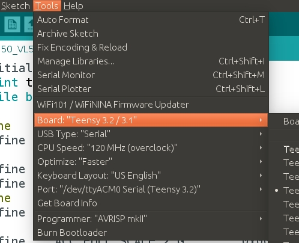

# Arduino code of IMU9250 and VL53L1X together on `Teensy 3.2`.

The setup requires the setup of teensy software and teensyduino library so you can compile your standard arduino code on teensy. Teensy 3.2 works at `72MHz` + overclocking upto `120MHz`. 
`pyserial` output sends IMU+distance data at about `1500Hz`. 

Note: Teensyduino works only with `arduino` versions: `1.0.6`, `1.6.5`, `1.8.1`, `1.8.5`, `1.8.7`, `1.8.8` and `1.8.9`.

Our setup is tested with `arduino-1.8.9` and `teensyduino-1.46`.

## The entire Setup:

1. Install `arduino-1.8.9` from [here for Linux x64](https://www.arduino.cc/download_handler.php?f=/arduino-1.8.9-linux64.tar.xz)
2. Download `teensy loader for Ubuntu Linux` from [here](https://www.pjrc.com/teensy/teensy_linux64.tar.gz). [Reference](https://www.pjrc.com/teensy/loader_linux.html)
3. Download `Linux udev rules` from [here](https://www.pjrc.com/teensy/49-teensy.rules). [Reference](https://www.pjrc.com/teensy/loader_linux.html)
4. Install `teensy loader`: 
```
cd ~/Downloads/
sudo cp 49-teensy.rules /etc/udev/rules.d/
tar -xvzf teensy_linux64.tar.gz
sudo chmod u+x teensy
./teensy &
```

5. Download `Teensyduino` from [here](https://www.pjrc.com/teensy/td_146/TeensyduinoInstall.linux64). [Reference](https://www.pjrc.com/teensy/td_download.html)
6. Unzip `TeensyduinoInstall.linux64`.
7. Install `Teensyduino`:
```
sudo chmod u+x TeensyduinoInstall.linux64
```
8. Select the `Arduino` Folder during the `Teensyduino` installation.
9. Once you are done with your installation, you should see something like this in your `arduino` application:

10. In `arduino` application, under `Tools`, make sure the board is setup to `teensy 3.2/3.1` and USB type `serial`. Tested with CPU speed: `120MHz (overclock)`. 

***


`IMU9250_VL531X` folder contains the code to get data from two sensors (IMU9250 and VL53L1X) at the same time.

## Installing Modified libraries for VL53L1x
* Go to the [time of flight](https://github.com/NitinJSanket/prg_prgeye/tree/master/Time_of_flight_sensors) directory in the prg_prgeye repo.
* Under the Libraries folder find VL53L1x driver.
* Copy and paste the folder in the libraries folder of your Arduino directory. For help on installing libraries manuall go to the [link](https://learn.adafruit.com/adafruit-all-about-arduino-libraries-install-use/how-to-install-a-library)

## Flashing code on Arduino
* Open the code in Ardunino IDE and connect the arduino using usb. For IMU or LIDAR pin connections checkout [this readme](https://github.com/NitinJSanket/prg_prgeye/blob/master/Time_of_flight_sensors/README.md)
* Select the proper Arduino board and port under the tools menu
* Upload the code using the gui or by using the shortcut ``` ctrl + u ```.


## Reading serial message using ROS
Open a terminal using ``` ctrl + alt + t ```. Type the following command to start roscore 
```
roscore
```
### Launching rosnode using python
* Open a new terminal and navigate to the directory where ```arduino-serial.py``` is located.
* To run type
```
python arduino-serial.py
```

### Launching rosnode using ROS
* Create a catkin workspace using the following commands:
```
mkdir -p ~/catkin_prg_ws/src
cd ~/catkin_prg_ws/
catkin_make
```
* Copy the folder (package) ```arduino_serial_read``` and paste it into the ```src``` folder of the workspace (catkin_prg_ws)
* use catkin_make
```
cd ~/catkin_prg_ws/
catkin_make
```
* source the workspace
```
source ~/catkin_prg_ws/devel/setup.bash
```
* run the node
```
rosrun arduino_serial_read arduino-serial.py
```
* To check the received messages open a new terminal and execute 
```
rostopic echo /imu_lidar_data
```
